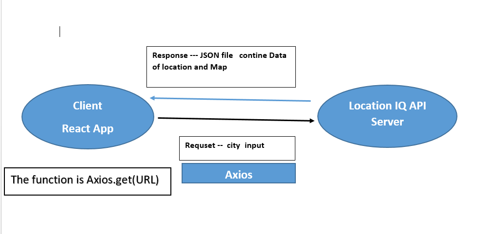

# City Explorer

**Author**: Shahd Nabeel Alkhatib
**Version**: 1.0.0 

## Overview
City Explorer  is the application 
There are inputs which are the name of a city and the output will be the name of the country and the map of the country and the longitude and latitude.

## Getting Started
1. clone for repo
2. npm i - dawnlod package 
3. npm start- Runs the app in the development mode.

## Architecture

<!-- Provide a detailed description of the application design. What technologies (languages, libraries, etc) you're using, and any other relevant design information. -->

## Change Log
<!-- Use this area to document the iterative changes made to your application as each feature is successfully implemented. Use time stamps. Here's an example:

01-01-2001 4:59pm - Application now has a fully-functional express server, with a GET route for the location resource. -->

## Credit and Collaborations
<!-- Give credit (and a link) to other people or resources that helped you build this application. -->

